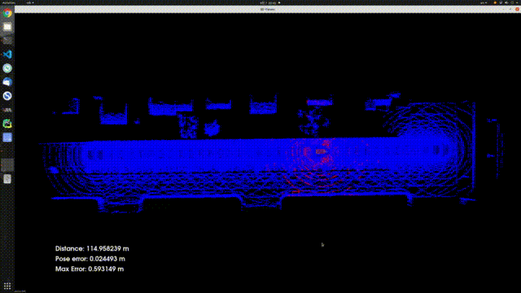

# Use NDT scan matching for vehicle localization 

Project Steps

There are three major steps to the project.

#### Step 1: Filter scan using voxel filter

The first step makes use of cloudFiltered and scanCloud to filter the point cloud using a voxel grid.

#### Step 2: Find pose transform by NDT matching
Use NDT matching to find the pose transformation. Use `getPose()` on the 4D transform matrix to get the Pose object.

#### Step 3: Transform the scan so it aligns with ego's actual pose and render that scan
Transform the filtered scan using the calculated transform into a new point cloud using pcl.

[Demo video](demo.webm)

